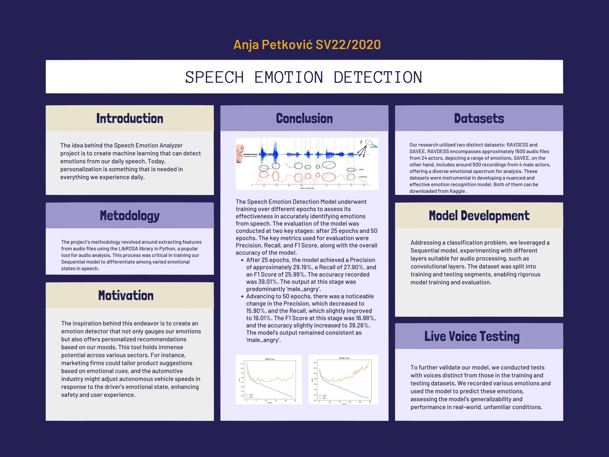

# emotion_detection_from_speech
Projekat iz predmeta Soft computing za školsku 2023/2024 godinu
## Tim
### Anja Petković SV22/2020

## Asistent
### Marko Njegomir

## Definicija problema
**Analizator Emocija u Govoru**
Ideja iza ovog projekta je stvaranje mašinskog učenja koje može da detektuje emocije iz govora koji koristimo svakodnevno. Danas je personalizacija nešto što je potrebno u svemu što svakodnevno doživljavamo.

## Motivacija problema
Kreiranje detektora emocija koji će ocenjivati naše emocije i u budućnosti preporučivati različite stvari na osnovu našeg raspoloženja. Ovo se može koristiti u više industrija kako bi se ponudile različite usluge, kao što su marketinške kompanije koje nam predlažu da kupujemo proizvode na osnovu naših emocija, automobilska industrija može detektovati emocije osobe i prilagoditi brzinu autonomnih automobila kako bi se izbegli sudari itd.

## Skup podataka
**Skupovi podataka:**
Korišćena su dva različita skupa podataka:

RAVDESS. Ovaj skup podataka uključuje oko 1500 audio datoteka od 24 različita glumca. 12 muškaraca i 12 žena gde ovi glumci snimaju kratke audio zapise u 8 različitih emocija tj. 1 = neutralno, 2 = mirno, 3 = srećno, 4 = tužno, 5 = ljuto, 6 = uplašeno, 7 = gađenje, 8 = iznenađenje.
Svaka audio datoteka je imenovana na takav način da sedmi karakter odgovara različitim emocijama koje predstavljaju.
Ovaj dataset se može preuzeti sa: https://www.kaggle.com/datasets/uwrfkaggler/ravdess-emotional-speech-audio

SAVEE. Ovaj skup podataka sadrži oko 500 audio datoteka snimljenih od 4 različita muška glumca. Prva dva karaktera imena datoteke odgovaraju različitim emocijama koje prikazuju.
Ovaj dataset se može preuzeti sa: https://www.kaggle.com/datasets/ejlok1/surrey-audiovisual-expressed-emotion-savee

**Audio datoteke**

**Spektrogram**

## Metodologija
**Izdvajanje Karakteristika**
Sledeći korak uključuje izdvajanje karakteristika iz audio datoteka koje će pomoći našem Sequential modelu da uči između ovih audio datoteka. Za izdvajanje karakteristika koristimo LibROSA biblioteku u Pythonu, koja je jedna od biblioteka korišćenih za analizu zvuka.

## Evaluacija

### Izgradnja Modela
Pošto se projekat bavi problemom klasifikacije, korišćenje Sequential modela u kombinaciji sa odgovarajućim slojevima se čini kao očigledan izbor. Za ovaj projekat, dataset je podeljen na 10% za testiranje i 90% za treniranje. U okviru Sequential modela, moguće je koristiti različite vrste slojeva, uključujući konvolucijske slojeve, jer se radi o obradi audio zapisa.

### Predviđanja
Nakon što je model podešen, testiran je predviđanjem emocija za test podatke. Podešavanje modela uključuje prilagođavanje slojeva, parametara i hiperparametara kako bi se postigla što bolja tačnost na test skupu.

### Testiranje snimljenim glasovima
Da bismo dodatno testirali model, koristimo glasove koji su potpuno različiti od onih koji se nalaze u podacima za obuku i testiranje. Snimamo glasove sa različitim emocijama i koristimo model za predviđanje emocija iz ovih snimaka. Ovo nam omogućava da testiramo kako model funkcioniše u realnim, nepoznatim uslovima i da procenimo njegovu sposobnost generalizacije na novim podacima.

